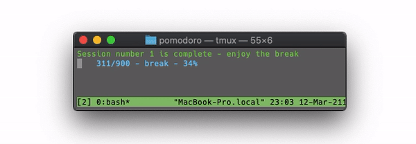

# POMODORO

A lightweight pomodoro timer for the mac command line. 



## Features

1. It has COLOURED TEXT
2. It SPEAKS when the sessions are over
3. It counts up in SECONDS - this is so that you really feel each second pass by - I find it really motivating.

*Ok... that is literally it... (I should really stop procrastinating)*

## Usage 

Clone the repo and make ./pomodoro executable by running the following in your terminal:

```console
git clone git@github.com:c-arthurs/pomodoro.git
cd pomodoro
chmod +x ./pomodoro
./pomodoro
```
That should get it running!

It will also work on Unix but it wont speak to you - so what is the point of that? 

Next you need to actually do some work, and so do I.

## Optional extras

You can also move the file into your path somewhere so that you can just run it as a command from anywhere on your system. 

The work and break times can be set as command arguments like so - 

```bash 
./pomodoro 25 5 # for 25 mins of work and 5 min break
./pomodoro 800 2 # for the beasts out there who work for 800 minutes with a 2 min break
./pomodoro 15 30 # for people more like me ... 
```

There are two args - first is work time, second is rest time
If left blank then the preset is 50 work 15 break

